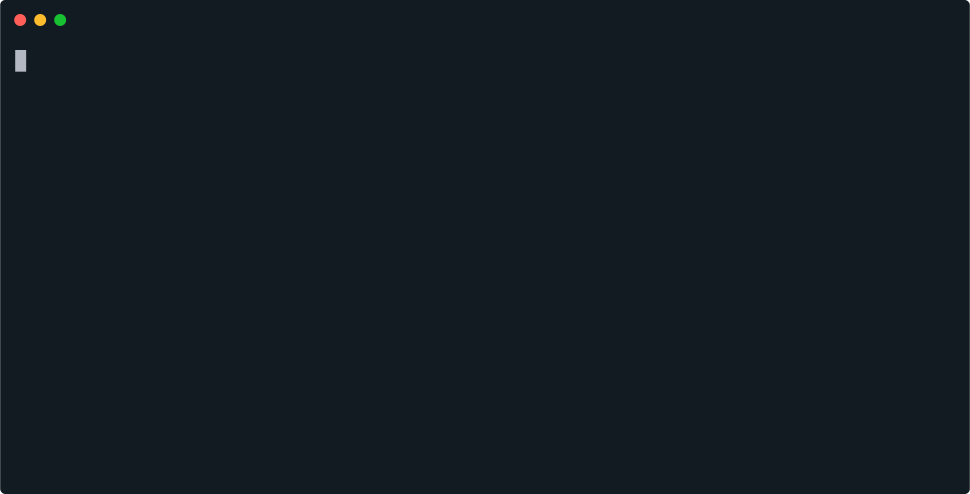

# Découverte de NodeJS

## Challenge 

Réaliser votre première application NodeJS.
Cette application écrite doit demander à l'utilisateur son âge et, à partir de cette valeur, lui retourner son année de naissance.

  

