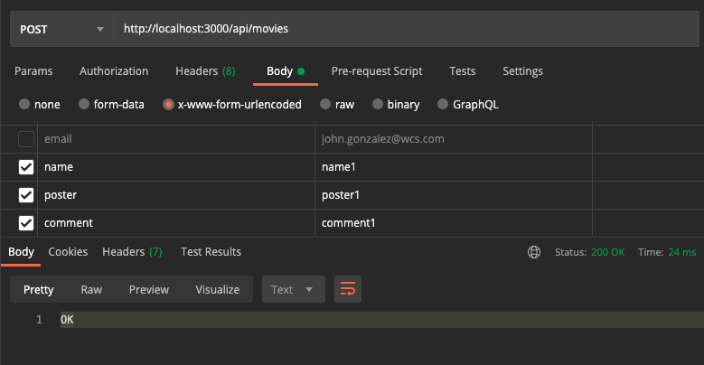
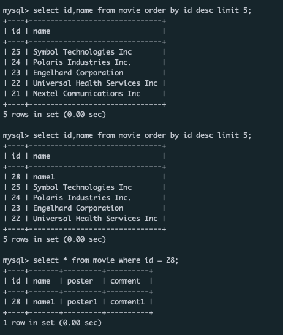

# Wild Code School : NodeJS

## [FR] Express 3 - Méthode POST et insertion de données

---- 
## Express 3 - Méthode POST et insertion de données

### Challenge

Insert a movie into the database

Now that you've created the post route for movies, let's create the post route to create users 

    Create a table users in the Database with 
        firstname
        lastname
        email

  

    Create a post route for /api/users that will insert a new user in the Database

  

