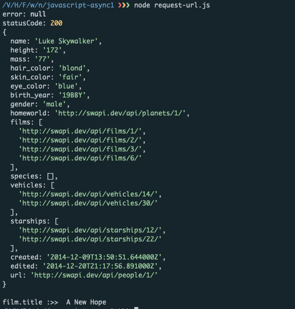

# JavaScript Asynchrone 1 - Synchrone vs Asynchrone

## Challenge 

### May the Force be with you!

Il existe des alternatives à fetch et axios, pour effectuer des requêtes HTTP. L'une d'entre elles est le module request. request utilise des callbacks, comme fs.readdir et fs.readFile.

Installe ce module dans le dossier javascript-async1 : npm install request. Puis copie-colle le premier exemple dans un fichier request-url.js, et exécute-le avec node request-url. Dans le callback, trois paramètres sont récupérés et affichés : l'éventuelle erreur (null sauf si tu as un problème réseau !), le code de statut HTTP (200 si tout va bien), et le corps de la réponse (le HTML de la page d'accueil de Google).

Commence par remplacer l'URL de Google par https://swapi.dev/api/people/1/. Tu vas ainsi récupérer les informations de Luke Skywalker depuis la Star Wars API.

Dans le callback, sous la dernière ligne, utilise JSON.parse sur le body, afin de décoder le JSON obtenu, et stocke le résultat dans une variable luke (contrairement à axios, request ne décode pas automatiquement les données JSON de la réponse).

Tu peux alors afficher luke dans la console, et luke.films : un tableau d'URL correspondant aux films dans lesquels Luke apparaît.

Ta mission consiste à effectuer un 2ème appel à l'API, en utilisant l'URL du premier film (luke.films[0]). Il s'agit plus ou moins de dupliquer le code du 1er appel, à l'intérieur du callback existant - tout comme on appelait fs.readFile dans le callback donné à fs.readdir.

Dans le callback du 2ème request, n'hésite pas à renommer les paramètres error, response et body, pour éviter de les confondre avec ceux du 1er callback.

Comme pour le 1er appel, décode le JSON obtenu, stocke le résultat dans une variable, et affiche le titre du film en question.

Publie ton code dans un Gist dont tu indiqueras l'URL.

### Critères de validation

    - Deux appels à request sont effectués.
    - Les appels sont correctement enchaînés, de telle sorte que le 2ème est lancé après le 1er.
    - Le titre du premier film est affiché dans la console.

### Files

  - [request-url.js](./request-url.js)

---- 

