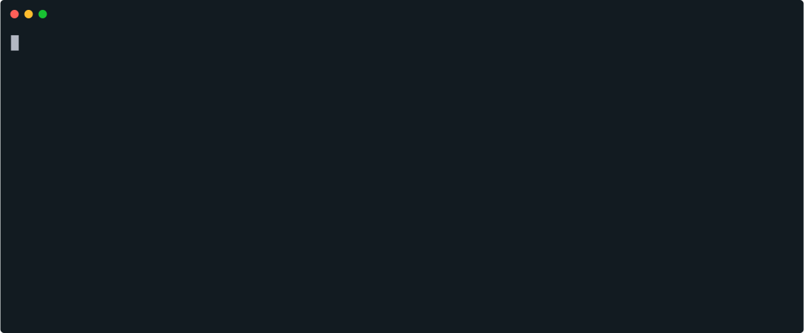

# Middlewares dans Express

## Challenge 

### In the middle of the road

Ecrire un middleware sur la route /superMiddleware qui affiche hello middleware dans le terminal (via un console.log()), à chaque appel de la page. 
Dans la fonction "next", afficher hello world à l'utilisateur (via un res.send()).

### Critères de validation

    - La route /superMiddleware contient deux fonctions
    - Le middleware comporte bien le next()
    - Le middleware affiche hello middleware en console

