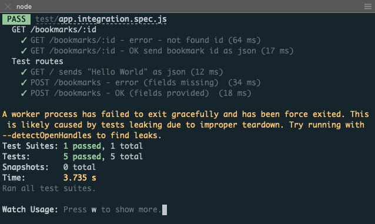

# Express et TDD - Tests d'intégration de routes Express

## Challenge 

### Récupérer un bookmark

Le but de ce challenge est d'implémenter la route permettant de récupérer un bookmark (GET sur /bookmarks/:id), par l'approche TDD.

Tu auras deux cas de test à écrire. Ils seront regroupés au sein d'un describe, placé à l'intérieur de celui déjà en place.

On te fournit le code de base de ce describe. On y utilise beforeEach pour réinitialiser la table et créer un bookmark, avant de lancer chaque test :

```js
describe('GET /bookmarks/:id', () => {
  const testBookmark = { url: 'https://nodejs.org/', title: 'Node.js' };
  beforeEach((done) => connection.query(
    'TRUNCATE bookmark', () => connection.query(
      'INSERT INTO bookmark SET ?', testBookmark, done
    )
  ));

  // Write your tests HERE!
});
```

Place-le à l'intérieur du describe existant. Tu vas y écrire tes tests, avec les exigences suivantes :

    - Cas d'erreur : on fournit dans l'URL appelée par request un id ne correspondant à aucun bookmark dans la base de données. On s'attend à recevoir :
        - le code de statut 404
        - un message d'erreur dans un objet : { error: 'Bookmark not found' }.
    - Cas de succès : on fournit un id qui existe bien. Ici c'est 1 car, après réinitialisation de la DB par le premier beforeEach, le testBookmark inséré par le deuxième aura forcément l'id 1. On s'attend alors à recevoir :
        - le code de statut 200
        - l'objet bookmark (valeurs de testBookmark plus l'id attribué par MySQL).

Tu devras ensuite implémenter la route permettant de faire passer ces tests (indice : la quête Express 6 peut t'aider...).

Partage l'URL de ton repo en guise de solution.


### Critères de validation

    - Deux cas de tests ont été ajoutés
    - Tous les tests passent

## Files

  - [app.js](./app.js)
  - [app.integration.spec.js](./test/app.integration.spec.js)

## Screenshot 

